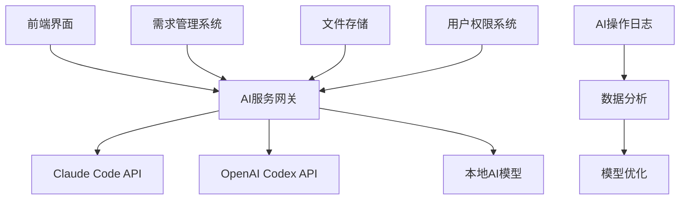
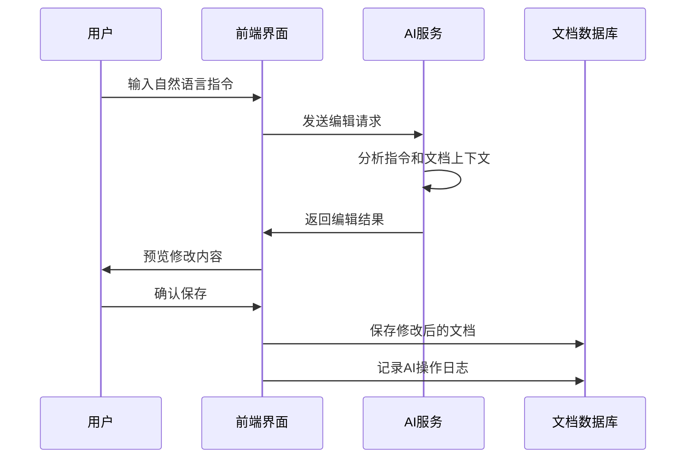
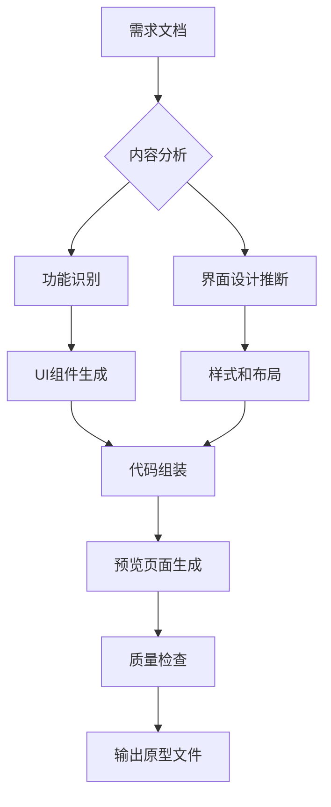

# 需求管理平台 - AI工具集成需求文档

## 1. 文档信息

| 项目 | 内容 |
|------|------|
| 文档名称 | 需求管理平台 - AI工具集成需求文档 |
| 文档版本 | V1.0 |
| 创建日期 | 2025-01-23 |
| 最后更新 | 2025-01-23 |
| 文档状态 | 草稿 |
| 负责人 | 产品团队 |
| 相关人员 | 产品经理、AI工程师、前端开发工程师、后端开发工程师 |

## 2. 功能概述

### 2.1 集成目标

在现有需求管理平台基础上，集成Claude Code和Codex等AI工具，实现：

- **智能文档编辑**：通过自然语言指令编辑和优化Markdown文档
- **自动原型生成**：基于需求描述自动生成HTML原型页面
- **智能分析助手**：提供需求分析、测试用例生成等AI辅助功能
- **实时协作优化**：AI辅助的需求评审和团队协作

### 2.2 技术架构



## 3. 核心AI功能模块

### 3.1 AI文档编辑器

#### 3.1.1 功能描述

集成Claude Code API，为用户提供智能化的Markdown文档编辑体验，支持自然语言指令进行文档操作。

#### 3.1.2 核心能力

**自然语言理解**：
- 支持中英文自然语言指令解析
- 理解需求文档的上下文和语义
- 支持复杂的编辑指令和组合操作

**智能编辑操作**：
- 内容重述和优化：改善表述和结构
- 格式标准化：自动调整Markdown格式
- 内容补充：基于上下文智能补充缺失信息
- 语言优化：改进用词和表达方式

**版本管理和撤销**：
- 完整的操作历史记录
- 支持多级撤销和重做
- 版本对比和差异显示

#### 3.1.3 用户交互流程



#### 3.1.4 接口设计

**请求格式**：
```json
POST /api/ai/edit-document
{
  "requirement_id": "REQ-2025-001",
  "instruction": "将用户登录流程的描述简化，添加流程图",
  "context": {
    "current_content": "现有文档内容...",
    "section": "用户故事",
    "target_audience": "开发团队"
  },
  "options": {
    "preserve_format": true,
    "generate_suggestions": true,
    "language": "zh-CN"
  }
}
```

**响应格式**：
```json
{
  "success": true,
  "data": {
    "modified_content": "修改后的文档内容",
    "changes": [
      {
        "type": "content_addition",
        "position": "第3段后",
        "content": "新增的用户登录流程描述"
      }
    ],
    "suggestions": [
      "建议添加用户登录流程的状态图",
      "可考虑添加异常处理场景"
    ],
    "operation_id": "AI-OP-20250123-001"
  }
}
```

### 3.2 AI原型生成器

#### 3.2.1 功能描述

基于需求文档内容，自动生成可交互的HTML原型页面，支持多种UI框架和技术栈。

#### 3.2.2 生成能力

**多框架支持**：
- React组件生成：支持现代React开发模式
- Vue组件生成：支持Vue 3 Composition API
- 原生HTML：生成标准HTML5+CSS3页面
- 响应式设计：自动适配移动端和桌面端

**智能UI设计**：
- 基于需求描述自动推断UI布局
- 智能配色和主题选择
- 交互逻辑自动生成
- 表单验证和状态管理

**代码质量保证**：
- 遵循WAI-ARIA无障碍标准
- 语义化HTML结构
- 优化的CSS和JavaScript
- 跨浏览器兼容性

#### 3.2.3 生成流程



#### 3.2.4 配置选项

**基础配置**：
```json
{
  "framework": "react|vue|html",
  "theme": "light|dark|auto",
  "layout": "desktop|mobile|responsive",
  "styling": "material|bootstrap|tailwind|custom"
}
```

**高级配置**：
```json
{
  "include_state_management": true,
  "add_form_validation": true,
  "generate_test_data": true,
  "accessibility_level": "AA|AAA",
  "performance_optimization": true
}
```

### 3.3 智能分析助手

#### 3.3.1 功能描述

提供全方位的AI辅助分析功能，帮助产品团队提高需求质量和开发效率。

#### 3.3.2 分析类型

**需求质量分析**：
- 完整性检查：识别缺失的关键信息
- 一致性验证：检查需求间的逻辑一致性
- 可测试性评估：分析需求的可测试程度
- 风险识别：预测潜在的技术和业务风险

**测试用例生成**：
- 基于需求描述自动生成测试用例
- 覆盖正常流程、边界情况、异常处理
- 生成测试数据和预期结果
- 提供测试优先级建议

**技术实现建议**：
- 架构设计建议：推荐合适的技术架构
- 数据库设计：基于需求生成数据模型
- API设计建议：RESTful API设计指导
- 性能优化建议：潜在的性能瓶颈和优化方案

#### 3.3.3 分析结果格式

```json
{
  "analysis_type": "requirement_quality",
  "overall_score": 85,
  "categories": {
    "completeness": {
      "score": 90,
      "issues": ["缺少非功能性需求"],
      "suggestions": ["添加性能要求描述"]
    },
    "consistency": {
      "score": 80,
      "issues": ["术语使用不一致"],
      "suggestions": ["建立术语表，统一用语"]
    },
    "testability": {
      "score": 85,
      "issues": ["验收标准不够明确"],
      "suggestions": ["添加具体的验收条件"]
    }
  },
  "generated_artifacts": {
    "test_cases": ["生成的测试用例列表"],
    "data_models": ["推荐的数据模型"],
    "api_specs": ["API接口设计建议"]
  }
}
```

## 4. 技术实现方案

### 4.1 API集成架构

#### 4.1.1 Claude Code集成

**认证和安全**：
```typescript
interface ClaudeCodeConfig {
  apiKey: string;
  baseUrl: string;
  maxTokens: number;
  temperature: number;
  model: 'claude-3-opus' | 'claude-3-sonnet' | 'claude-3-haiku';
}

class ClaudeCodeService {
  private config: ClaudeCodeConfig;

  async editDocument(instruction: string, content: string): Promise<EditResult> {
    // Claude Code API调用实现
  }

  async generatePrototype(requirements: string): Promise<PrototypeCode> {
    // 原型生成实现
  }

  async analyzeRequirement(content: string): Promise<AnalysisResult> {
    // 需求分析实现
  }
}
```

**错误处理和重试**：
- 指数退避策略应对API限制
- 优雅降级：API不可用时使用本地能力
- 详细的错误日志和用户提示

#### 4.1.2 OpenAI Codex集成

```typescript
interface CodexConfig {
  apiKey: string;
  model: 'gpt-4-codex' | 'gpt-3.5-turbo';
  maxTokens: number;
  temperature: number;
}

class CodexService {
  async generateCode(prompt: string, language: string): Promise<GeneratedCode> {
    // Codex代码生成实现
  }

  async optimizeCode(code: string, language: string): Promise<OptimizedCode> {
    // 代码优化实现
  }
}
```

### 4.2 前端集成方案

#### 4.2.1 React组件设计

**AI编辑器组件**：
```typescript
interface AIEditorProps {
  content: string;
  onSave: (content: string, aiOperations: AIOperation[]) => void;
  aiEnabled: boolean;
}

const AIEditor: React.FC<AIEditorProps> = ({
  content,
  onSave,
  aiEnabled
}) => {
  const [aiAssistantOpen, setAiAssistantOpen] = useState(false);
  const [currentInstruction, setCurrentInstruction] = useState('');

  const handleAIEdit = async (instruction: string) => {
    // AI编辑逻辑
  };

  return (
    <div className="ai-editor-container">
      <MarkdownEditor
        content={content}
        onChange={setLocalContent}
      />
      {aiEnabled && (
        <AIAssistant
          isOpen={aiAssistantOpen}
          onInstruction={handleAIEdit}
          history={aiOperationHistory}
        />
      )}
    </div>
  );
};
```

**原型预览组件**：
```typescript
interface PrototypePreviewProps {
  htmlCode: string;
  cssCode: string;
  jsCode: string;
  framework: 'react' | 'vue' | 'html';
}

const PrototypePreview: React.FC<PrototypePreviewProps> = ({
  htmlCode,
  cssCode,
  jsCode,
  framework
}) => {
  // 实时预览实现
};
```

#### 4.2.2 状态管理

**Redux Store结构**：
```typescript
interface AIState {
  editor: {
    isProcessing: boolean;
    currentOperation: AIOperation | null;
    history: AIOperation[];
  };
  prototype: {
    generatedCode: GeneratedCode | null;
    previewUrl: string | null;
    framework: string;
  };
  analysis: {
    results: AnalysisResult[];
    isAnalyzing: boolean;
  };
}

// AI相关的Actions
const aiSlice = createSlice({
  name: 'ai',
  initialState,
  reducers: {
    startAIOperation: (state, action) => {
      state.editor.isProcessing = true;
      state.editor.currentOperation = action.payload;
    },
    completeAIOperation: (state, action) => {
      state.editor.isProcessing = false;
      state.editor.history.push(action.payload);
    },
    setGeneratedPrototype: (state, action) => {
      state.prototype.generatedCode = action.payload;
    }
  }
});
```

### 4.3 后端服务设计

#### 4.3.1 AI服务控制器

```typescript
@Controller('/api/ai')
export class AIController {

  @Post('/edit-document')
  async editDocument(
    @Body() request: EditDocumentRequest,
    @CurrentUser() user: User
  ): Promise<EditDocumentResponse> {
    // 验证用户权限
    // 调用AI服务
    // 记录操作日志
    // 返回结果
  }

  @Post('/generate-prototype')
  async generatePrototype(
    @Body() request: GeneratePrototypeRequest,
    @CurrentUser() user: User
  ): Promise<GeneratePrototypeResponse> {
    // 原型生成逻辑
  }

  @Post('/analyze-requirement')
  async analyzeRequirement(
    @Body() request: AnalyzeRequirementRequest,
    @CurrentUser() user: User
  ): Promise<AnalyzeRequirementResponse> {
    // 需求分析逻辑
  }
}
```

#### 4.3.2 AI服务层

```typescript
@Injectable()
export class AIService {

  constructor(
    private claudeCodeService: ClaudeCodeService,
    private codexService: CodexService,
    private operationRepository: AIOperationRepository
  ) {}

  async editDocument(request: EditDocumentRequest): Promise<EditResult> {
    try {
      // 选择合适的AI模型
      const aiService = this.selectAIService(request.aiModel);

      // 执行AI编辑
      const result = await aiService.editDocument(
        request.instruction,
        request.context.currentContent
      );

      // 记录操作日志
      await this.operationRepository.create({
        userId: request.userId,
        requirementId: request.requirementId,
        operationType: 'edit_document',
        aiModel: request.aiModel,
        inputData: request,
        outputData: result,
        status: 'success'
      });

      return result;
    } catch (error) {
      // 错误处理和记录
      await this.operationRepository.create({
        // 错误日志记录
        status: 'failed',
        error: error.message
      });
      throw error;
    }
  }

  private selectAIService(model: string): ClaudeCodeService | CodexService {
    switch (model) {
      case 'claude-code':
        return this.claudeCodeService;
      case 'codex':
        return this.codexService;
      default:
        return this.claudeCodeService; // 默认使用Claude
    }
  }
}
```

## 5. 数据存储设计

### 5.1 AI操作优化

#### 5.1.1 用户偏好学习

```sql
CREATE TABLE user_ai_preferences (
  id BIGINT PRIMARY KEY AUTO_INCREMENT,
  user_id BIGINT NOT NULL,
  preference_type ENUM('writing_style', 'technical_level', 'ui_preferences'),
  preference_data JSON NOT NULL,
  created_at TIMESTAMP DEFAULT CURRENT_TIMESTAMP,
  updated_at TIMESTAMP DEFAULT CURRENT_TIMESTAMP ON UPDATE CURRENT_TIMESTAMP,
  FOREIGN KEY (user_id) REFERENCES users(id),
  INDEX idx_user_preference (user_id, preference_type)
);
```

#### 5.1.2 AI模型性能统计

```sql
CREATE TABLE ai_model_performance (
  id BIGINT PRIMARY KEY AUTO_INCREMENT,
  model_name VARCHAR(50) NOT NULL,
  operation_type ENUM('edit', 'generate', 'analyze') NOT NULL,
  success_rate DECIMAL(5,2) NOT NULL,
  avg_response_time INT NOT NULL,
  user_satisfaction_score DECIMAL(3,1),
  recorded_date DATE NOT NULL,
  INDEX idx_model_date (model_name, recorded_date)
);
```

### 5.2 缓存策略

**多层缓存架构**：
- L1缓存：内存缓存，存储常用AI响应
- L2缓存：Redis缓存，存储用户会话和操作历史
- L3缓存：数据库缓存，存储AI模型和配置

**缓存策略**：
```typescript
class AICacheManager {
  private memoryCache: Map<string, any>;
  private redisClient: Redis;

  async get(key: string): Promise<any> {
    // 1. 检查内存缓存
    if (this.memoryCache.has(key)) {
      return this.memoryCache.get(key);
    }

    // 2. 检查Redis缓存
    const cached = await this.redisClient.get(key);
    if (cached) {
      this.memoryCache.set(key, JSON.parse(cached));
      return JSON.parse(cached);
    }

    return null;
  }

  async set(key: string, value: any, ttl: number): Promise<void> {
    // 设置多层缓存
    this.memoryCache.set(key, value);
    await this.redisClient.setex(key, ttl, JSON.stringify(value));
  }
}
```

## 6. 质量保证和监控

### 6.1 AI输出质量评估

#### 6.1.1 自动质量检查

**内容质量指标**：
- 准确性：AI输出是否符合用户意图
- 完整性：是否完整执行了用户要求
- 一致性：与原文档风格和术语的一致性
- 可用性：生成内容的实用性

**检查算法**：
```typescript
class QualityAssessment {
  assessEditQuality(original: string, edited: string, instruction: string): QualityScore {
    const accuracy = this.calculateAccuracy(original, edited, instruction);
    const completeness = this.calculateCompleteness(instruction, edited);
    const consistency = this.calculateConsistency(original, edited);

    return {
      overall: (accuracy + completeness + consistency) / 3,
      accuracy,
      completeness,
      consistency,
      suggestions: this.generateImprovementSuggestions(edited)
    };
  }

  private calculateAccuracy(original: string, edited: string, instruction: string): number {
    // 使用语义相似度算法计算准确性
  }

  private calculateCompleteness(instruction: string, result: string): number {
    // 检查是否完全覆盖了指令要求
  }
}
```

#### 6.1.2 用户反馈机制

**反馈收集**：
- 显式反馈：用户主动对AI结果进行评分
- 隐式反馈：通过用户行为分析满意度
- A/B测试：对比不同AI模型的效果

**反馈处理**：
```typescript
interface UserFeedback {
  operationId: string;
  userId: string;
  rating: 1 | 2 | 3 | 4 | 5;
  comment?: string;
  issues?: string[];
  improvements?: string[];
}

class FeedbackProcessor {
  async processFeedback(feedback: UserFeedback): Promise<void> {
    // 更新用户偏好
    await this.updateUserPreferences(feedback);

    // 调整AI模型参数
    await this.adjustModelParameters(feedback);

    // 记录质量统计
    await this.recordQualityMetrics(feedback);
  }
}
```

### 6.2 性能监控

#### 6.2.1 关键指标

**系统性能指标**：
- AI响应时间：平均API调用耗时
- 并发处理能力：同时处理的AI请求数
- 缓存命中率：缓存的有效性
- 错误率：AI调用失败的比例

**业务指标**：
- 用户采用率：使用AI功能的用户比例
- 任务完成率：AI协助下的任务完成率
- 时间节省：相比手动操作节省的时间
- 满意度：用户对AI功能的满意度

#### 6.2.2 监控实现

```typescript
class AIMonitoring {
  private metricsCollector: MetricsCollector;

  async trackAIOperation(
    operation: AIOperation,
    startTime: number,
    success: boolean,
    error?: Error
  ): Promise<void> {
    const duration = Date.now() - startTime;

    await this.metricsCollector.record({
      metricName: 'ai_operation_duration',
      value: duration,
      tags: {
        operation_type: operation.type,
        ai_model: operation.aiModel,
        success: success.toString()
      }
    });

    if (!success && error) {
      await this.metricsCollector.record({
        metricName: 'ai_operation_error',
        value: 1,
        tags: {
          error_type: error.name,
          operation_type: operation.type
        }
      });
    }
  }

  async generateQualityReport(): Promise<QualityReport> {
    // 生成AI质量报告
  }
}
```

## 7. 安全和隐私

### 7.1 数据安全

#### 7.1.1 敏感信息处理

**数据脱敏**：
- 自动识别和移除个人身份信息
- 对敏感业务数据进行遮蔽处理
- 保留数据结构和格式，隐藏具体内容

**访问控制**：
```typescript
class AISecurityService {
  async sanitizeInput(input: string, userContext: UserContext): Promise<string> {
    // 移除敏感信息
    let sanitized = input;

    // 检测和移除个人信息
    sanitized = this.removePersonalInfo(sanitized);

    // 检测和遮蔽数据库连接信息
    sanitized = this.maskDatabaseInfo(sanitized);

    // 检测和移除API密钥
    sanitized = this.removeApiKeys(sanitized);

    return sanitized;
  }

  async checkDataLeakage(content: string): Promise<boolean> {
    // 检查是否可能泄露敏感信息
    const sensitivePatterns = [
      /\b\d{4}[-\s]?\d{4}[-\s]?\d{4}[-\s]?\d{4}\b/, // 信用卡号
      /\b[A-Za-z0-9._%+-]+@[A-Za-z0-9.-]+\.[A-Z|a-z]{2,}\b/, // 邮箱
      /sk-[A-Za-z0-9]{48}/, // API密钥格式
    ];

    return sensitivePatterns.some(pattern => pattern.test(content));
  }
}
```

#### 7.1.2 权限管理

**AI功能权限**：
- 基础权限：所有用户可使用基础AI编辑
- 高级权限：管理员可使用原型生成和批量分析
- 审计权限：安全团队可查看AI操作日志

```sql
CREATE TABLE ai_permissions (
  id BIGINT PRIMARY KEY AUTO_INCREMENT,
  user_id BIGINT NOT NULL,
  ai_feature ENUM('edit', 'generate_prototype', 'analyze', 'batch_process') NOT NULL,
  permission_level ENUM('basic', 'advanced', 'admin') NOT NULL,
  granted_by BIGINT,
  granted_at TIMESTAMP DEFAULT CURRENT_TIMESTAMP,
  expires_at TIMESTAMP,
  FOREIGN KEY (user_id) REFERENCES users(id),
  FOREIGN KEY (granted_by) REFERENCES users(id)
);
```

### 7.2 审计和合规

#### 7.2.1 操作审计

**完整审计日志**：
```typescript
interface AuditLog {
  id: string;
  userId: string;
  operationType: 'ai_edit' | 'prototype_generate' | 'requirement_analyze';
  aiModel: string;
  inputDataHash: string; // 输入数据的哈希值，不记录原始内容
  outputDataHash: string; // 输出数据的哈希值
  ipAddress: string;
  userAgent: string;
  timestamp: Date;
  success: boolean;
  errorCode?: string;
}

class AuditService {
  async logOperation(operation: AIOperation): Promise<void> {
    const auditLog: AuditLog = {
      id: generateUUID(),
      userId: operation.userId,
      operationType: operation.type,
      aiModel: operation.aiModel,
      inputDataHash: await this.hashData(operation.inputData),
      outputDataHash: await this.hashData(operation.outputData),
      ipAddress: operation.context.ipAddress,
      userAgent: operation.context.userAgent,
      timestamp: new Date(),
      success: operation.success
    };

    await this.auditRepository.create(auditLog);
  }

  private async hashData(data: any): Promise<string> {
    const crypto = require('crypto');
    return crypto.createHash('sha256')
      .update(JSON.stringify(data))
      .digest('hex');
  }
}
```

#### 7.2.2 合规检查

**数据保护合规**：
- GDPR兼容：支持数据删除和更正请求
- 数据本地化：确保数据存储在指定区域
- 保留策略：自动清理过期的AI操作数据

## 8. 部署和运维

### 8.1 环境配置

#### 8.1.1 AI服务配置

```yaml
# 生产环境配置
ai_services:
  claude_code:
    api_key: ${CLAUDE_API_KEY}
    base_url: "https://api.anthropic.com"
    max_tokens: 4096
    temperature: 0.1
    timeout: 30000

  codex:
    api_key: ${OPENAI_API_KEY}
    base_url: "https://api.openai.com"
    model: "gpt-4-codex"
    max_tokens: 2048
    temperature: 0.2
    timeout: 25000

  rate_limiting:
    requests_per_minute: 60
    requests_per_hour: 1000
    burst_limit: 10

  caching:
    redis_url: ${REDIS_URL}
    default_ttl: 3600
    max_memory_size: 1000
```

#### 8.1.2 监控配置

```yaml
# Prometheus监控指标
monitoring:
  metrics:
    - ai_request_duration
    - ai_success_rate
    - ai_error_rate
    - cache_hit_rate
    - active_ai_sessions

  alerts:
    - name: "AI响应时间过长"
      condition: "ai_request_duration > 30000"
      severity: "warning"

    - name: "AI成功率过低"
      condition: "ai_success_rate < 0.95"
      severity: "critical"

    - name: "AI服务不可用"
      condition: "ai_health_check == 0"
      severity: "critical"
```

### 8.2 运维策略

#### 8.2.1 灾难恢复

**服务降级策略**：
```typescript
class ServiceDegradation {
  async handleAIServiceFailure(service: string): Promise<void> {
    // 1. 记录故障
    await this.alerting.sendAlert({
      level: 'critical',
      message: `${service} service is down`,
      service: service
    });

    // 2. 启用降级模式
    await this.cacheManager.set('ai_degradation_mode', true, 3600);

    // 3. 切换到备用AI服务
    const fallbackService = this.getFallbackService(service);
    if (fallbackService) {
      await this.serviceManager.switchService(fallbackService);
    }

    // 4. 通知用户
    await this.notificationService.broadcast({
      type: 'ai_service_degradation',
      message: 'AI服务暂时不可用，正在使用备用方案'
    });
  }
}
```

**数据备份策略**：
- 实时备份：AI操作日志的实时复制
- 定期备份：每日完整数据备份
- 异地备份：跨地域的数据冗余存储

## 9. 成本估算和ROI分析

### 9.1 成本分析

#### 9.1.1 API调用成本

**Claude Code成本**：
- 输入Token：$0.015/1K tokens
- 输出Token：$0.075/1K tokens
- 预估月使用量：50万输入Token + 100万输出Token
- 月成本：$82.5

**OpenAI Codex成本**：
- GPT-4-Codex：$0.03/1K tokens
- 预估月使用量：80万tokens
- 月成本：$24

**基础设施成本**：
- Redis缓存：$20/月
- 监控和日志：$30/月
- 备份存储：$15/月

**总月成本预估**：$171.5

#### 9.1.2 ROI计算

**效率提升收益**：
- 文档编辑时间减少60%：每月节省200小时
- 原型开发时间减少70%：每月节省150小时
- 需求分析时间减少50%：每月节省100小时

**成本效益分析**：
- 每小时开发成本：$150
- 每月节省成本：(200+150+100) × $150 = $67,500
- 投资回报率：(67,500 - 171.5) / 171.5 = 39,280%
- 投资回收期：< 1个月

### 9.2 风险评估

#### 9.2.1 技术风险

| 风险 | 概率 | 影响 | 缓解措施 |
|------|------|------|----------|
| AI服务不稳定 | 中 | 高 | 多服务商策略，本地降级方案 |
| API成本超预算 | 中 | 中 | 实时成本监控，用量限制 |
| 数据泄露风险 | 低 | 极高 | 严格的数据脱敏和审计 |
| 依赖服务变更 | 中 | 中 | 保持多版本兼容，适配层设计 |

#### 9.2.2 业务风险

| 风险 | 概率 | 影响 | 缓解措施 |
|------|------|------|----------|
| 用户接受度低 | 中 | 高 | 充分培训，渐进式推广 |
| AI质量不达标 | 中 | 中 | 持续优化，人工审核机制 |
| 过度依赖AI | 低 | 中 | 保留手动操作选项，混合工作模式 |

## 10. 实施计划

### 10.1 开发阶段

#### 10.1.1 Phase 1：基础集成（4周）

**第1周：环境搭建和API集成**
- Claude Code和OpenAI API接入
- 基础AI服务框架搭建
- 开发和测试环境配置

**第2周：AI文档编辑器开发**
- 自然语言指令解析
- Markdown文档编辑功能
- 基础用户界面开发

**第3周：原型生成器开发**
- HTML/CSS/JS代码生成
- 多框架支持实现
- 预览功能开发

**第4周：测试和优化**
- 单元测试和集成测试
- 性能优化和错误处理
- 基础功能验证

#### 10.1.2 Phase 2：高级功能（3周）

**第5周：智能分析助手**
- 需求质量分析算法
- 测试用例生成
- 分析结果展示界面

**第6周：用户体验优化**
- AI操作历史管理
- 用户偏好学习
- 界面交互优化

**第7周：质量保证和监控**
- AI输出质量评估
- 完整的监控体系
- 安全审计和权限管理

### 10.2 上线策略

#### 10.2.1 灰度发布

**内部测试（1周）**：
- 仅限产品和开发团队使用
- 收集初步反馈和问题
- 功能稳定性和性能验证

**小范围试用（2周）**：
- 扩展到2个业务团队
- 每日收集使用反馈
- 快速迭代和问题修复

**逐步扩大（3周）**：
- 按团队规模逐步开放
- 培训和支持文档完善
- 监控系统稳定性和用户满意度

#### 10.2.2 完整上线

**全量发布（1周）**：
- 所有用户开放使用
- 完整的培训和推广计划
- 持续监控和优化

---

**文档状态**：
- V1.0：初始版本，定义完整的AI工具集成需求
- 下一步：技术架构设计和详细开发计划制定