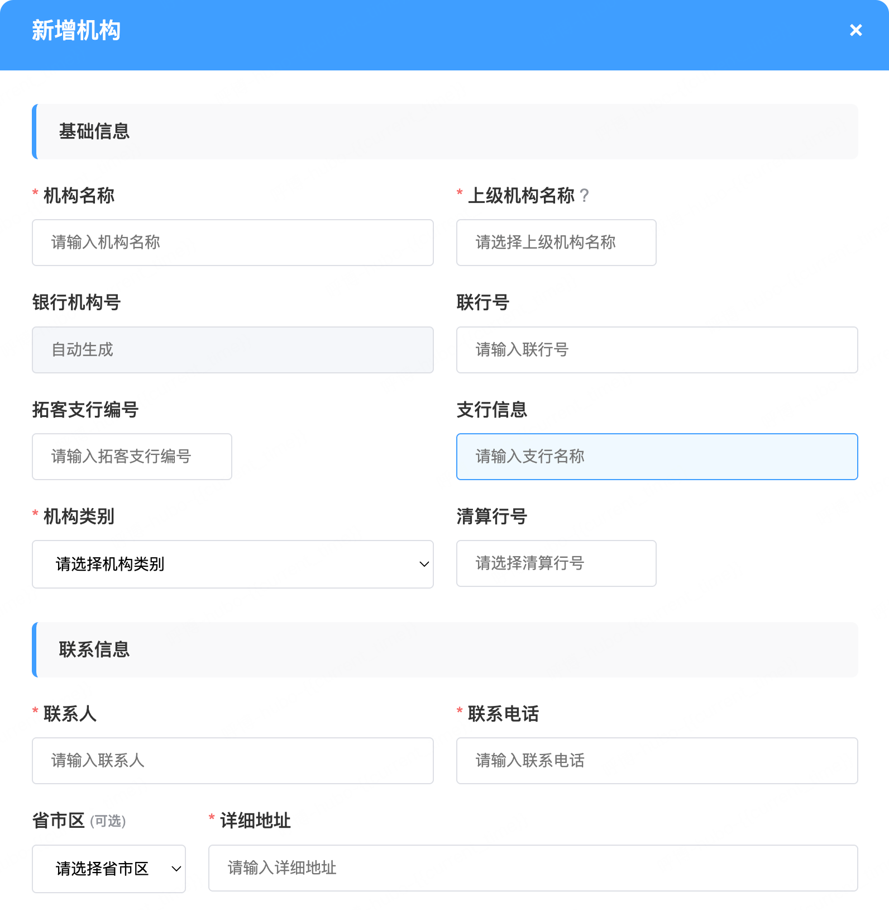

# 银行联合营销平台-机构银行新增功能优化需求PRD

## 1. 需求背景与商业价值

### 1.1 业务背景

银行联合营销平台目前在创建机构银行时没有能与拓客系统支行编号关联，拓客系统改造成本高，周期长，因此，在营销平台侧增加拓客系统支行编号，进行匹配处理。

### 1.2 用户痛点

- **信息不完整**：当前机构新增时缺少拓客支行信息，商户报名活动时只能关联总行
- **必填项过多**：省市区为必填项，但在某些业务场景下并非必需

## 2. 产品需求详细说明

### 2.1 功能需求清单

#### 2.1.1 新增字段功能（优先级：P0）

**功能标识**：F001-新增字段
**详细描述**：在机构新增页面的基础信息部分增加以下字段：

1. **拓客行号**

   - 字段类型：文本输入框
   - 字段属性：非必填
   - 验证规则：纯数字，长度8-15位
2. **支行名称**

   - 字段类型：文本输入框
   - 字段属性：非必填
   - 验证规则：中文、英文、数字，最大长度100字符

#### 2.1.2 字段属性调整功能（优先级：P0）

**功能标识**：F002-字段属性调整
**详细描述**：将省市区字段由必填改为非必填

- **调整内容**：省市区选择器取消必填标识
- **验证调整**：移除省市区的必填验证逻辑

#### 2.1.3 批量导入功能优化（优先级：P1）

**功能标识**：F003-批量导入优化
**详细描述**：扩展批量新增和批量修改的导入模板和验证逻辑

- **模板更新**：Excel模板新增2个字段列
- **移除必填**：数据完整性校验省市区修改为非必填
- **错误提示**：优化错误信息展示和定位
- **导入预览**：支持导入前数据预览确认

#### 2.1.4 数据查询

**功能标识**：F004-数据查询
**详细描述**：机构管理-机构网点的查询数据表中，增加两列：拓客行号、支行名称

#### 2.1.5 数据关联功能（优先级：P2）

**功能标识**：F005-数据关联
**详细描述**：实现银行机构号与拓客支号的关联

- **支行信息联动**：代理为商户报名后，通过拓客上送的支行编号信息，将匹配到的银行机构号与商户进行关联，若支行编号信息未匹配到银行机构，则关联到总行。

  
