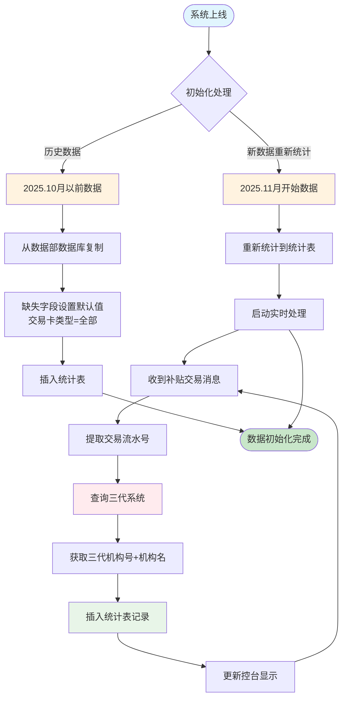
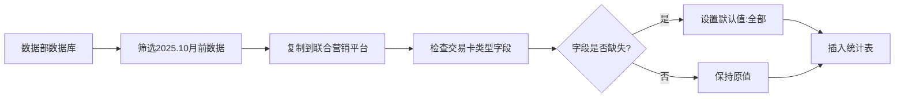
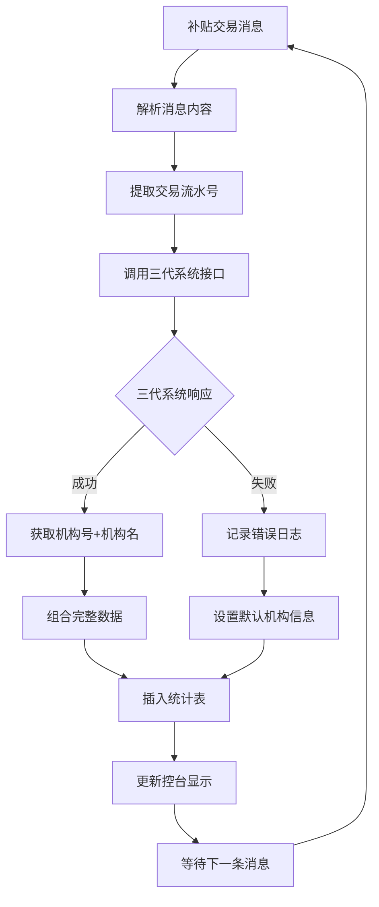
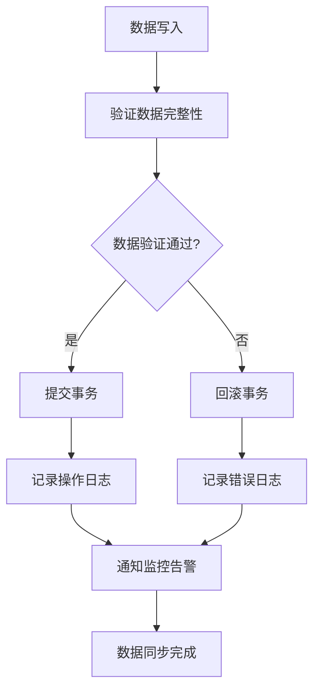

# 控台汇总表数据源切换PRD

## 1. 背景与目标

### 1.1 项目背景

当前控台汇总表数据易出现漏统计，导致不准确，影响运营与银行人员的核对工作。

### 1.2 项目目标

实现控台汇总表数据源查询联合营销平台自有统计数据表，实时接收消息更新。

## 2. 功能需求

### 2.1 联合营销平台

对以下页面数据源做改造，同时去掉筛选项中的“是否排序”。

| 功能模块       | 功能描述                                   |
| -------------- | ------------------------------------------ |
| 活动日汇总     | 展示一个活动ID的自然日内汇总数据           |
| 活动月汇总     | 展示一个活动ID的自然月内汇总数据           |
| 商户活动日汇总 | 展示一个商户在一个活动ID的自然日内汇总数据 |
| 商户活动月汇总 | 展示一个商户在一个活动ID的自然月内汇总数据 |

#### 2.2银行联合营销平台

将以下页面从BI页面修改为自建页面

2.2.1活动日汇总、月汇总

筛选项为：银行ID（下拉），政策ID（手输），活动ID（手输），交易日期，交易方向。

其中交易时间必选；政策ID或活动ID其一必选。

日汇总页面交易日期为日期段，可选择最长31天的区间。

月汇总页面交易日期选择自然月。

功能项为搜索、重置、下载。点击下载后进入下载中心下载。

展示字段依次为：序号、政策ID，政策名称、活动ID、活动名称、交易日期、交易类型、累计商户数、累计交易金额、累计补贴金额、累计手续费、累计交易笔数。

2.2.2商户活动日汇总、月汇总

筛选项为：银行ID（下拉），政策ID（手输），活动ID（手输），商户号，交易日期，交易方向。

其中交易时间必选；政策ID或活动ID其一必选。

日汇总页面交易日期为日期段，可选择最长31天的区间。

月汇总页面交易日期选择自然月。

功能项为搜索、重置、下载。点击下载后进入下载中心下载。

展示字段依次为：序号、政策ID，政策名称、活动ID、活动名称、商户号、商户名称、交易日期、交易类型、累计交易金额、累计补贴金额、累计手续费、累计交易笔数、银行结算补贴金额、三代机构号、三代机构名。

## 3. 数据结构

### 3.1 数据底表详情

#### 3.1.1 活动商户补贴汇总日报表

**表名：** `bmt_activity_mer_subsidy_sum_d`

**表注释：** 活动商户补贴汇总日报表

**主键：** (merchant_code, activity_id, trade_type, trans_date)

| 字段名 | 数据类型 | 长度 | 是否为空 |  注释 |
|--------|----------|------|----------|------|
| merchant_code | varchar | 32 | NOT NULL |商户号 |
| activity_id | varchar | 20 | NOT NULL |活动ID |
| activity_name | varchar | 255 | NULL |活动名称 |
| trade_type | varchar | 16 | NOT NULL |交易方向 |
| card_type | varchar | 16 | NOT NULL |交易卡类型 |
| trans_date | date |NOT NULL |交易时间yyyy-MM-dd |
| subsidy_cnt | bigint |NULL |补贴笔数 |
| subsidy_mer_num | varchar | 16 | NULL |补贴商户数 |
| pay_amt | varchar | 32 | NULL |累计交易金额 |
| fee_amount | varchar | 32 | NULL |累计交易交易手续费 |
| shd_subsidy_amt | varchar | 32 | NULL |累计交易应结补贴金额 |
| subsidy_amount | varchar | 32 | NULL |累计交易补贴金额 |
| data_type | varchar | 16 | NULL |数据类型 1:昨日有效(每天) 2:结束日期为昨日(每天) 3:截至当前有效(每月1号) 4：结束日期为上月(每月1号) |
| owner_id | varchar | 8 | NULL |业主ID |
| owner_name | varchar | 255 | NULL |业主机构名称 |
| templet_id | varchar | 32 | NULL |政策ID |
| templet_name | varchar | 255 | NULL |政策名称 |
| organ_id | varchar | 32 | NULL |三代机构号 |
| organ_name | varchar | 255 | NULL |三代机构名称 |
| merchant_name | varchar | 255 | NULL |商户名称 |
| gmt_create | datetime |NULL |创建时间 |
| create_by | varchar | 255 | NULL |创建人 |
| etl_dt | varchar | 16 | NULL |数据部同步时间 |

#### 3.1.2 补贴交易明细表

**表名：** `msa_activity_subsidy_record`

### 3.2 字段与指标定义

#### 3.2.1活动日、月汇总

维度字段（Group By）：

- activity_id
- txn_time（取交易时间的对应日期or月份）
- trade_type（交易类型：1正向，2反向）
- card_type  （交易卡类型：01,-全部,02-微信, 03-支付宝, 04-银联二维码,05-刷卡）

指标字段：

* txn_count：交易笔数 = count(distinct log_notxn_id)；
* mer_count：商户数 = count(distinct merc_nouser_id)；
* pay_amt_sum：交易金额汇总 = sum(pay_amt)，反向交易控台展示为-；
* subsidy_amount_sum：补贴金额汇总 = sum(subsidy_amount)，反向交易控台展示为-；
* fee_amount_sum：手续费金额汇总 = sum(fee_amount)，反向交易控台展示为-；

#### 3.2.2商户活动日、月汇总

维度字段（Group By）：

* merc_no
* activity_id
* txn_time（取交易时间的对应日期or月份）
* trade_type（交易类型：1正向，2反向）
* card_type  （交易卡类型：01,-全部,02-微信, 03-支付宝, 04-银联二维码,05-刷卡）

指标字段：

* txn_count：交易笔数 = count(distinct log_notxn_id)；
* pay_amt_sum：交易金额汇总 = sum(pay_amt)，反向交易控台展示为-；
* subsidy_amount_sum：补贴金额汇总 = sum(subsidy_amount)，反向交易控台展示为-；
* fee_amount_sum：手续费金额汇总 = sum(fee_amount)，反向交易控台展示为-；
* reserve3_amount_sum:银行结算补贴金额汇总 = sum(reserve3_fee_amount)，反向交易控台展示为-；

### 4. 统计表逻辑

- 2025.10月以前的数据，从现有数据部提供的数据库复制使用，缺失的维度字段交易卡类型，初始化存储为全部
- 上线时将2025.11开始的数据重新统计到统计表，并从上线后开始，将所有的补贴交易消息，收到后实时增加到统计表，补贴交易消息接口文档：[https://confluence.lakala.sh.in/pages/viewpage.action?pageId=21896174](https://)
- 收到补贴交易消息时，使用交易流水号到三代系统查询三代机构号+三代机构名同时落到数据库，供控台显示

#### 4.1 统计表数据处理流程图

#### 4.2 详细处理逻辑说明

**阶段一：历史数据处理**

**阶段二：实时消息处理**

**阶段三：数据一致性保障**

