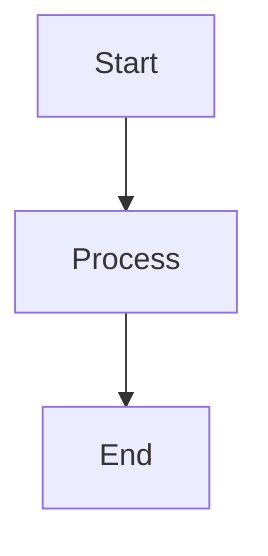
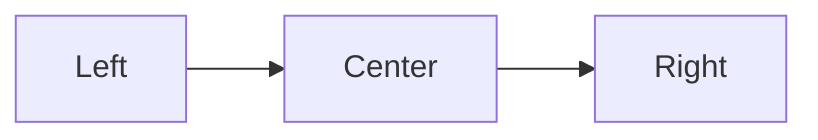
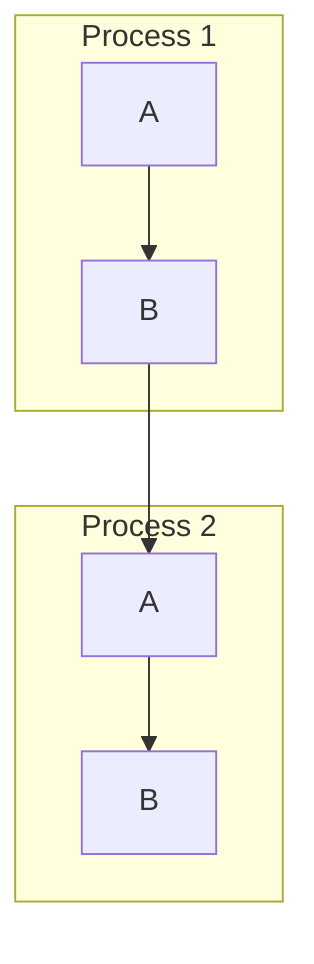

# Mermaid专用测试

这个文件专门用于测试Mermaid图表渲染功能。

## 简单流程图

```mermaid
graph TD
    A[Start] --> B[Process]
    B --> C[End]
```

## 水平流程图

```mermaid
graph LR
    A[Left] --> B[Center]
    B --> C[Right]
```

## 子图测试

```mermaid
graph TB
    subgraph Process 1
        A1[A] --> B1[B]
    end

    subgraph Process 2
        A2[A] --> B2[B]
    end

    B1 --> A2
```

## 测试说明

以上图表应该显示为流程图而不是原始代码。如果看到原始代码，说明Mermaid渲染有问题。

可能的解决方案：
1. 刷新页面
2. 检查浏览器控制台错误
3. 确保网络连接正常
4. 尝试禁用浏览器扩展