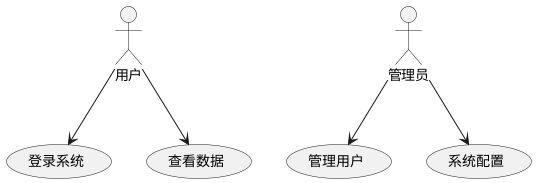
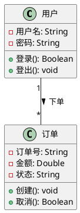

# 中文PlantUML测试

这个文件用于测试PlantUML是否支持中文字符。

## 中文用例图测试

```plantuml
@startuml
actor 用户
actor 管理员

用户 --> (登录系统)
用户 --> (查看数据)
管理员 --> (管理用户)
管理员 --> (系统配置)
@enduml
```

## 中文类图测试

```plantuml
@startuml
class 用户 {
  -用户名: String
  -密码: String
  +登录(): Boolean
  +登出(): void
}

class 订单 {
  -订单号: String
  -金额: Double
  -状态: String
  +创建(): void
  +取消(): Boolean
}

用户 "1" -- "*" 订单 : 下单 >
@enduml
```

## 测试说明

如果以上中文PlantUML图表能正常显示，说明UTF-8编码修复成功！