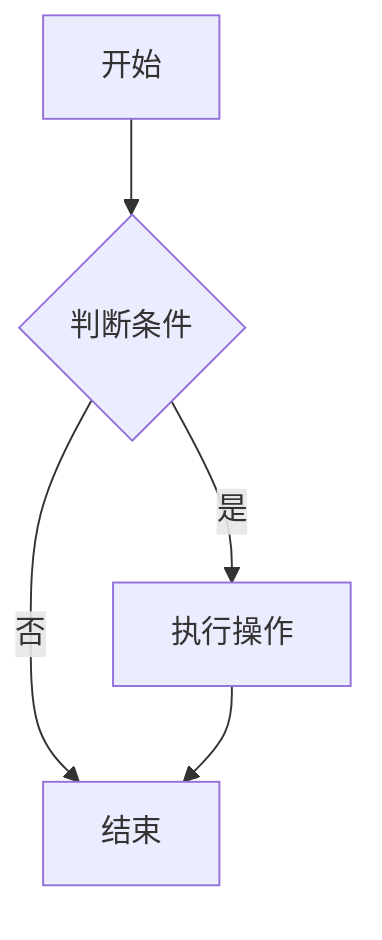
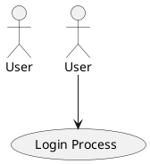

# 图表功能测试文档

这是一个用于测试Markdown查看器图表渲染功能的示例文档。

## Mermaid流程图测试

### 简单流程图



## PlantUML图表测试

### 简单用例图



## ECharts图表测试

### 简单柱状图

```echarts
{
  "title": {
    "text": "销售数据"
  },
  "xAxis": {
    "type": "category",
    "data": ["A", "B", "C"]
  },
  "yAxis": {
    "type": "value"
  },
  "series": [{
    "type": "bar",
    "data": [120, 200, 150]
  }]
}
```

## 测试说明

以上三个图表应该能正常显示：
1. Mermaid流程图
2. PlantUML用例图
3. ECharts柱状图

如果图表显示为原始文字而不是图表，请检查浏览器控制台的错误信息。