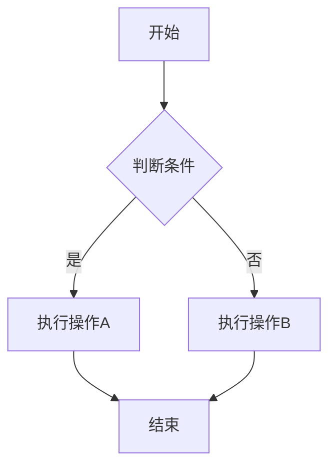
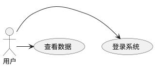

# 本地渲染功能测试

这是一个专门测试本地Canvas渲染功能的文档。

## Mermaid本地渲染测试



## PlantUML本地渲染测试



## ECharts本地渲染测试

```echarts
{
  "title": {
    "text": "本地渲染测试"
  },
  "xAxis": {
    "type": "category",
    "data": ["A", "B", "C"]
  },
  "yAxis": {
    "type": "value"
  },
  "series": [{
    "data": [120, 200, 150],
    "type": "bar",
    "itemStyle": {
      "color": "#5470c6"
    }
  }]
}
```

## 测试说明

以上图表应该：
1. 优先使用本地Canvas渲染
2. 显示"✓ 本地XX渲染 (离线模式)"标识
3. 在没有网络连接的情况下也能正常工作
4. 提供基本图表功能的手工绘制版本